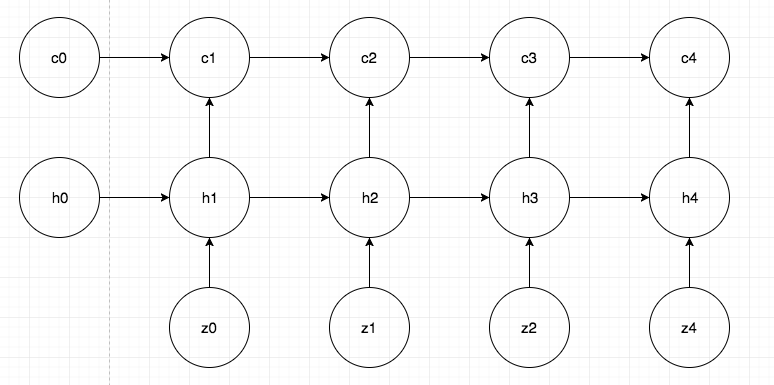
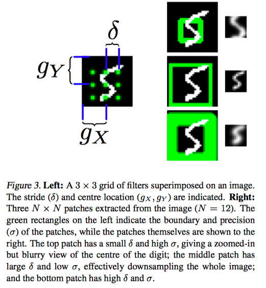
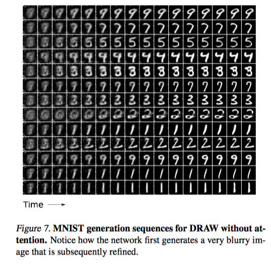
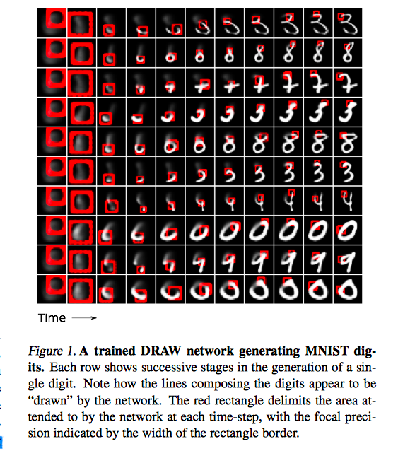

* DRAW: A Recurrent Neural Network For Image Generation
* Karol Gregor

# Generation and Inference

**Generation.** Though implicitly specified, the paper tries to make asssumption on the data generation process:

Here, $z_1, \ldots, z_T$ are sampled **independently** from some prior. After that,

* A delta $w_1$ is computed from $z_1$, and $c_1 = c_0 + w_1$
* A delta $w_2$ is computed from $z_1, z_2$, and $c_2 = c_1 + w_2$
* etc...

Here we are basically describing a way of generating an image from several latent variables, iteratively. **Intuitively, the ordering of $z_i$'s shoud reflect the importance of each variable.** 

**Inference**. Now given $x$, we need to infer $z_1, \ldots, z_T$. Typically, $z_1$ should encode the most important information of $x$, so it is natural to infer that first. After that, given $x, z_1$, we infer $z_2$, etc. 

From the above description, it is natural to design to seperate neural networks to perform generation and inference. 

**Generation**.

For $i = 1, \ldots, T$

1. $z_t\sim p(z)$ 
2. $h^{dec}_t = \text{RNN}^{dec}(h_{t-1}^{dec}, z_t)$
3. $c_t = c_{t-1} + write(h_t^{dec})$

And finally, $x\sim p(x|c_T)$.

**Inference**

The idea is to infer $z_t$ given $x, z_{t-1}, \ldots, z_{1}$. We will encode this using $h^{dec}_t$. Since $h_{t-1}^{dec}$ encodes $z_1, \ldots, z_{t-1}$, we can naturally do this  model $h^{enc}_t$ as a function of $x$ and $h^{dec}_{t-1}$. 

In theory that should be suffcient. But nonetheless the author do it the following way
$$
\hat x_t = x - \sigma(c_{t-1})\\
r_t = read(x_t, \hat x_t, h^{dec}_{t-1})\\
h^{enc}_t = \text{RNN}^{enc}(h_{t-1}^{enc}, [r_t, h^{dec}_{t-1}])\\
z_t \sim q(z_t|h^{enc}_t)
$$
Where $\hat x_t$ is called the **error image**. This makes sense since givne $z_1, \ldots, z_{t-1}$, $c_{t-1}$ has been determined, so conditioned on $x$ is equivalent to be conditioned on $\hat x$.

**Loss**. The loss is just the variational lower bound.

# Read and Write

**No attention**. In the simplest case, no attention is used. It is then just
$$
read(x, \hat x, h^{dec}_{t-1}) = [x, \hat x]\\
write(h^{dec}_{t-1}) = W(h_t^{dec})
$$
where $W$ is some linear NN.

**Selective attention**. The key is the form of attention. Here, we want the output of $read$ and $write$ to be fixed-sized. So it is natural to use a $N\times N$ grid to sample from the input, in $read$. Specifically, this grid is specified as

* $g_X, g_Y$: grid center
* $\delta$: stride
* $\sigma^2$: filter size
* $\gamma$: response intensity.

And these will be obtained via a linear transformation of $h^{dec}$. I won't address the details of these process,  but finally, the read operation can be written as
$$
\operatorname{read}\left(x, \hat{x}_{t}, h_{t-1}^{d e c}\right)=\gamma\left[F_{Y} x F_{X}^{T}, F_{Y} \hat{x} F_{X}^{T}\right]
$$
and the write operation will be a inverse process as
$$
\begin{aligned} w_{t} &=W\left(h_{t}^{d e c}\right) \\ \text {write}\left(h_{t}^{d e c}\right) &=\frac{1}{\hat{\gamma}} \hat{F}_{Y}^{T} w_{t} \hat{F}_{X} \end{aligned}
$$

# Results

The most important thing to note is how the network with and without attention works:

The author does not given an explanation of this.

