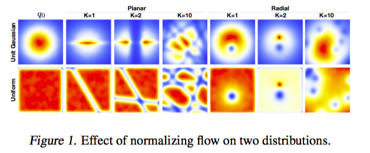

* Variational Inference with Normalizing Flows
* Danilo Jimenez Rezende, Shakir Mohamed

# Motivation

* A really good tutorial: https://deepgenerativemodels.github.io/notes/flow/
* This is even better: http://akosiorek.github.io/ml/2018/04/03/norm_flows.html

In VI, we often use very simple approximate posteriors. This places a restriction on the quality of inferences made using variational methods.

Normalizing flow is basically transforming a simple initial density with a sequence of transformations, such that the transformed density will be complex enough. If we include parameters in the transformation, we are actually defining a richer family of distributions than the original density.

# Noramlizing flow

We will only consider invertable transformations $f:\mathbb R^d \mapsto \mathbb R^d$ with a inverse $f^{-1} = g$. Let $\bf z$ be a random variable with distribution $q(\mathbf z)$, and let $z' = f(z)$, then the distribution of $z'$ is given by
$$
q\left(\mathbf{z}^{\prime}\right)=q(\mathbf{z})\left|\operatorname{det} \frac{\partial f^{-1}}{\partial \mathbf{z}^{\prime}}\right|=q(\mathbf{z})\left|\operatorname{det} \frac{\partial f}{\partial \mathbf{z}}\right|^{-1}
$$
Suppose we apply a sequence of $f_k$, then
$$
\begin{aligned} \mathbf{z}_{K} &=f_{K} \circ \ldots \circ f_{2} \circ f_{1}\left(\mathbf{z}_{0}\right) \\ \ln q_{K}\left(\mathbf{z}_{K}\right) &=\ln q_{0}\left(\mathbf{z}_{0}\right)-\sum_{k=1}^{K} \ln \left|\operatorname{det} \frac{\partial f_{k}}{\partial \mathbf{z}_{k-1}}\right| \end{aligned}
$$
The only problem with this approach is its computational complexity in evaluating Jacobian determinants. And what is left is to design $f_k$'s.

# Inference with Normalizing Flows

By definition, Jacobian determinants denotes the degree of contraction or expansian of density at a particular point. So we should design a transformation whose contraction and expansion effects are easy to describe.

We will choose the transformation
$$
f(\mathbf{z})=\mathbf{z}+\mathbf{u} h\left(\mathbf{w}^{\top} \mathbf{z}+b\right)
$$
where $u, w, b$ are parameters, and $h$ is an elementwise nonlinear function. The Jacobian is given by
$$
\begin{array}{c}{\psi(\mathbf{z})=h^{\prime}\left(\mathbf{w}^{\top} \mathbf{z}+b\right) \mathbf{w}} \\ {\left|\operatorname{det} \frac{\partial f}{\partial \mathbf{z}}\right|=\left|\operatorname{det}\left(\mathbf{I}+\mathbf{u} \psi(\mathbf{z})^{\top}\right)\right|=\left|1+\mathbf{u}^{\top} \psi(\mathbf{z})\right|}\end{array}
$$
The important thing is, evaluating this only involves complexity linear with the hidden dimensions.

Looking at the determinant, we can also see that this is doing expansian and contraction perpendicular to the hyperplane $w^Tz + b = 0$. So this also called **planar flow**. 

Examples:

Now the free energy is
$$
\begin{aligned} \mathcal{F}(\mathbf{x}) &=\mathbb{E}_{q_{\phi}(z | x)}\left[\log q_{\phi}(\mathbf{z} | \mathbf{x})-\log p(\mathbf{x}, \mathbf{z})\right] \\ &=\mathbb{E}_{q_{0}\left(z_{0}\right)}\left[\ln q_{K}\left(\mathbf{z}_{K}\right)-\log p\left(\mathbf{x}, \mathbf{z}_{K}\right)\right] \\ &=\mathbb{E}_{q_{0}\left(z_{0}\right)}\left[\ln q_{0}\left(\mathbf{z}_{0}\right)\right]-\mathbb{E}_{q_{0}\left(z_{0}\right)}\left[\log p\left(\mathbf{x}, \mathbf{z}_{K}\right)\right] \\ &-\mathbb{E}_{q_{0}\left(z_{0}\right)}\left[\sum_{k=1}^{K} \ln \left|1+\mathbf{u}_{k}^{\top} \psi_{k}\left(\mathbf{z}_{k-1}\right)\right|\right] \end{aligned}
$$
If we use amortized variational inference, we will use a neural network to map the observations $x$ to the parameters of the initial density $q_0 =\mathcal N(\mu, \sigma)$ as well as the parameters of the flow.

