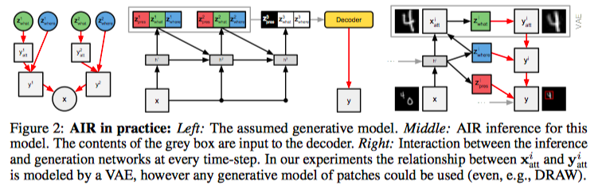

* Attend Infer Repeat: Fast Scene Understanding with Generative Models
* S. M. Ali Eslami, Geoffrey E. Hinton

# Assumption

Here we assume that, naturally, a scene with multiple objects are generated as follows:

* The number of objects $n$ is drawn from $p(n)$
* For $i = 1, \ldots, n$, determine $z^i$ from $p_{\theta}(z)$
* Generate the scene using $p_\theta(x|z)$.

That is
$$
p_{\theta}(\mathbf{x})=\sum_{n=1}^{N} p_{N}(n) \int p_{\theta}^{z}(\mathbf{z} | n) p_{\theta}^{x}(\mathbf{x} | \mathbf{z}) \mathrm{d} \mathbf{z}
$$

# Inference

We can in theory directly model $q_\phi(z, n|x)$. But there are two difficulties:

* Trans-dimensionality: the number of $z^i$'s is itself a random variable
* Symmetry: $z^i$ should be permutation-invariant

This is resolved with recurrent neural networks. First, we will denote $z_{pres}$ as indicator for $n$. For given $n$, $z_{pres}$ is a vector of $n$ 1's, followed by 0's. Given this, we can model $q_\phi$ as 
$$
q_{\phi}\left(\mathbf{z}, \mathbf{z}_{\mathrm{pres}} | \mathbf{x}\right)=q_{\phi}\left(z_{\mathrm{pres}}^{n+1}=0 | \mathbf{z}^{1 : n}, \mathbf{x}\right) \prod_{i=1}^{n} q_{\phi}\left(\mathbf{z}^{i}, z_{\mathrm{pres}}^{i}=1 | \mathbf{x}, \mathbf{z}^{1 : i-1}\right)
$$
Several notes here:

* We only need to consider $z, z_{pres}$ combination that has **non-zero** probabilities, since we will sample from $q_\phi$, and then evaluate $q_\phi$. If we define the sampling process carefully, we don't need to consider zero-probability $q_\phi$
* The condition part should really include $z^i_{prse} = 1$. But since this is always true, we can just omit this during modeling.
* In essence, we are assuming an infinite number of $z^i$ and $z_{pres}^i$. 
* Conditioning on $z^{1:i-1}, x$ is modeled with hidden states of the RNN.

# Learning

Just trivial. Different gradient estimation for discrete and continuous variables:

* Continuous: reparametrization
* Discrete: Monte Carlo with a **neural baseline** to reduce variance.

# Models and Experiments

First, for 2D experiments, there are three types of $z$:

* $z_{pres}^i$: presence of object $i$
* $z_{where}^i$: 3-D, position and scale
* $z^i_{what}$: identity

Here we must specify two things:

* The exact form of $p(x|z)$
* The exact form of $q(z^i|x, z^{1:i-1})$.

For the first, we assume that at each time step, a $y^i$ is generated, and they are summed to $x$. Each $y^i$ is generated as follows:

* from $z_{what}^i$, we generate the digit $y^i_{att}$
* from $z_{where}^i$ and $y^i_{att}$, we generate the component $y^i$. 

**Notes**: 

* Note that the generative model is not modeled as an RNN. $p_N(n)$ is modeled as a geometric distribution, $p(z_{what})$ is sample from unit Gaussian, and $p(z_{where})$ is sample from a Gaussian with a predefined covariance matrix.
* The meaning of $z^i_{where}$ is predefined since it is used to scale and shift the attention image.

Inference goes in the opposite direction. This is best illustrated with this figure:

## Experiments:

* Multi-MNIST: correctly infers the number of digits. **Note there are not gradient propagate through $z^{pres}$**. The result is a combination of the pressure to explain the scene, and the cost from the geometric prior.
* Strong generalization: interpolation
* Representation power: for downstream tasks
* 3D scenes: when the generative model is specified using a differential renderer, this network can be used to infer the pose and identity of the objects.

