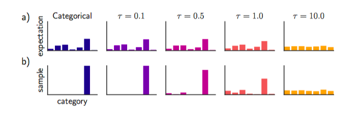

* Categorical Reparametrization with Gumbel-Softmax
* Eric Jang, Shixiang Gu, Ben Poole

# Motivation

When we are trying to introduce distributions into our objectives, we will often need a stochastic computation graph. Generally, there will be stochastic "nodes" which are samples from a distribution. To allow backpropagation, we will either require that the sample is directly differentiable with respect to the parameters. For Gaussian, this is easy with reparametrization trick. For discrete, categorical distributions, it is unclear how we can do this.

This work proposed a new distribution Gumbel-Softmax distribution that approximate a categorical distribution, and reparametrization trick is possible with this distribution. It is differentiable.

# The Gumbel-Softmax Distribution

Let $z$ be a categorical variable with class probabilities $\pi_1, \pi_2, \ldots, \pi_k$. We assume that samples are encoded as $k$-dimensional one-hot vectors. With this encodings, the Gumbel-Max trick can be use to draw samples from categocial distribution:
$$
z = \text{one_hot}(\arg\max_i[g_i + \log \pi_i])
$$
where $g_i$'s are drawn from Gumbel(0, 1). Instead of argmax, we use softmax as a continuous, differentiable approximation to $\arg\max$: 
$$
y_{i}=\frac{\exp \left(\left(\log \left(\pi_{i}\right)+g_{i}\right) / \tau\right)}{\sum_{j=1}^{k} \exp \left(\left(\log \left(\pi_{j}\right)+g_{j}\right) / \tau\right)}
$$
Note with this distribution, $y$ that is non-one hot will still have non-zero density. As softmax temperature $\tau$ approaches zero, samples from the Gumbel-Softmax distribution become one hot.

The following is the expectation of the distribution, and what the samples looks like.

There is a trade-off. Using small temperatres, samples are close to one-hot but the variance is large. With large temperatures, samples are smooth but the variance is small. In practice you can anneal the temperature as you train.

Replacing categorical samples with Gumbel-Softmax samples we can use backpropagation to compute gradients. This is just the Gumbel-Softmax estimator

**Straight-Through Gumbel Estimator**: when the samples are required to be one-hot. In this case, you can discretize $y$ using argmax in the forward pass but use softmax to compute local gradients during backpropagation.

Related works

* Path Derivative Gradient Estimators
  * Reparametrization trick
  * Straight-through: use fixed approximate gradient.
* score function: REINFORCE. Based on $\nabla_{\theta} p_{\theta}(z)=p_{\theta}(z) \nabla_{\theta} \log p_{\theta}(z)$ you can compute $\nabla_{\theta} \mathbb{E}_{z}[f(z)]=\mathbb{E}_{z}\left[f(z) \nabla_{\theta} \log p_{\theta}(z)\right]$. The problem is that the variance is high. So there are many variants.

# Experiments

* Structure output prediction: on MNIST, predict the lower half, given the upper half.
* VAE on MNIST: trivial. 
* Semi-supervised classfication: this replaces the original marginlization-based inference approach with a single-sample inference with Gumbel-Softmax. And with this approach, it is possible to generalize to many classes.

