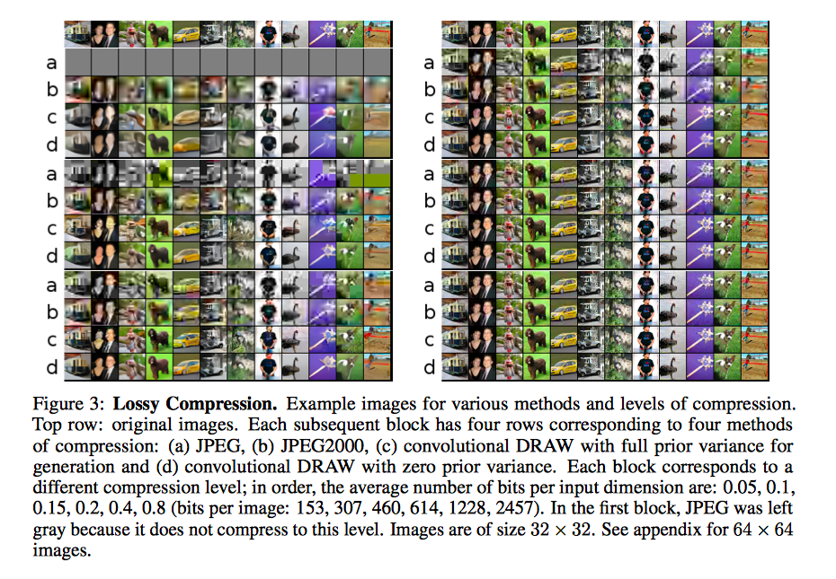

* Towards Conceptual Compression
* Karol Gregor

I think this work just proposes an effect they observed about DRAW without attention. No much new stuffs are presented.

The idea is that, DRAW without attention seems to capture the latent factors in a hierarchical way. The first latent captures the identity of the digit, and following latents captures gradually lower level information. This is the key idea of "conceptual compression".

To preform lossy compression, we can then just store the first $k$ latents. During decompression, we can fix the first $k$ latents, and generate the following. That will give us a decompressed image.

The author does not seem to address why this will happen. But from an intuitive way, each modification $w_i$ is generated from

* $w_1$ from $z_1$
* $w_2$ from $z_1, z_2$
* $w_3$ from $z_1, z_2, z_3$
* etc

It seems that earlier $z_i$'s will have a larger impact on the final input (more modifications are dependent on them). So it is natural that $z_i$ will be contain more high level information.

