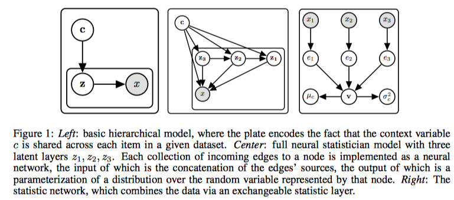

* Towards a Neural Statistician
* Harrison Edwards Amos Storkey

# Idea

Here instead of dealing with a single dataset, we are presented with multiple datasets, and our goal is to obtain a summary for each of these dataset. 

Here I use my own notation. Datasets are represented as $X_i$'s, and their latents are $Z_i$'s. This is the common assumption used in general generative models. This work introduces a new random variable $c$ called **context**, that accounts for the variations in different datasets. In particular, the model is defined as
$$
p(X) = \int p(c) [\int p(X|Z) p(Z|c) dZ] dc
$$
The crucial thing is that there is only a single $c$ for a single dataset.

# Basic Model

For the following I will use the paper's notation. They just replace $X$ with $D$. So their model is
$$
p(D)=\int p(c)\left[\prod_{x \in D} \int p(x | z ; \theta) p(z | c ; \theta) d z\right] d c
$$
Inference is two folds. Two inference models are defined:

* $q(c|D; \phi)$ infers the context given the dataset
* $q(z|x, c; \phi)$ infers $z$ given a single $x$ and the context $c$. 

These naturally translates into this lower bound:
$$
\mathcal{L}_{D}=\mathbb{E}_{q(c | D ; \phi)}\left[\sum_{x \in d} \mathbb{E}_{q(z | c, x ; \phi)}[\log p(x | z ; \theta)]-D_{K L}(q(z | c, x ; \phi) \| p(z | c ; \theta))\right]
$$

# Full Model

This just introduces a more powerful generative model, as shown in the middle of figure 1. $k$ latents are introduced, and
$$
p(D)=\int p(c) \prod_{x \in D} \int p\left(x | c, z_{1 : L} ; \theta\right) p\left(z_{L} | c ; \theta\right) \prod_{i=1}^{L-1} p\left(z_{i} | z_{i+1}, c ; \theta\right) d z_{1 : L} d c
$$
Inference:
$$
q\left(c, z_{1 : L} | D ; \phi\right)=q(c | D ; \phi) \prod_{x \in D} q\left(z_{L} | x, c ; \phi\right) \prod_{i=1}^{L-1} q\left(z_{i} | z_{i+1}, x, c ; \phi\right)
$$
Just trivial.

# Statistical Network

We call the network that models $q(c|D;\phi)$ as a statistical network. In this work, this involves

* An instance encoder $E$ that encodes individual datapoint $x_i$ to $e_i = E(x_i)$
* An exchangeable instance polling layer that collpases the matrix $(e_1, \ldots, e_k)$ to a single pre-statistic vector $v$.
* A final post polling network that takes $v$ to a parametrization of a diagonal Gaussian.

# Experiments

The most important thing is to note that, we must have a **large number** of datasets. They are preferred to be small.

* Simple 1-D distributions: each dataset is a single type of distribution of various mean and variance. The context describes the type, mean and variance of the distribution
* Spatial MNIST: each single image is represented as a set of points, and thus a single dataset.
* Omnisglot. The important thing is that is composes of several classes. Three examples of fea-shot learning:
  * Training on a subset of datasets, and do conditional generation (dataset reconstruction) on unseen datasets in OMNIGLOT
  * Do generation on MNIST
* Few-shoting classification. The idea is just to use $c$ as a class embedding.
* Youtube faces: same as above.

