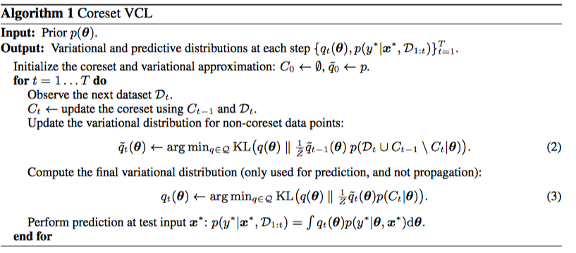
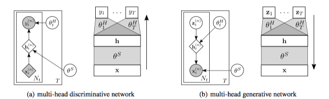

* Variational Continual Learning
* Cuong V. Nguyen, E. Turner

# The Problem

We are given a sequence of datasets $D_1, \ldots, D_T$. This dataset can even be for different tasks. Our goal is, upon receiving a new dataset $D_t$, update our model from $m_{t-1}$, to $m_t$, so that it adapts to the new dataset, but **still works for all previous datasets**. This is continual learning.

# The Idea

Assume that datasets and datapoints are independent (but they can have different distributions, although they may share parameters). Then, $p(\theta| D_{1:T})$ can be decomposed as
$$
p(\theta|D_{1:T}) \propto p(D_{1:T}|\theta) p(\theta) = p(D_{1:T-1}|\theta)p(D_T|\theta)p(\theta) = p(\theta|D_{1:T-1})p(D_T|\theta)
$$
Here, $p(\theta|D_{1:T})$ will be our model that summarizes $D_{1:T}$. When given $D_{T+1}$, we compute $p(\theta |D_{1:T+1})$ by multiplying $p(\theta|D_{1:T})$ with $p(D_T|\theta)$, and normarlizing.

However, $p(\theta|D_{1:T})$ is intractable. So we will use an $q_t(\theta)$ to approximate this. If we define the operator $proj$ as
$$
proj(p^*(\theta)) = \arg \min_{q\in Q} KL(q(\theta)\| p^*(\theta))
$$
Then we can compute $q_t(\theta)$ recursively as
$$
q_t(\theta) = proj(q_{t-1}(\theta) p(D_t|\theta))
$$

# Episodic Memory Enhancement

$q_t(\theta)$ is an approximation. Plus, $q_t$ is computed recursively. This means error can easily accumulate. To mitigate this problem, we extend VCL to include a small representative set of data $C_t$ for $D_{1:t}$, which we will call the "coreset". **We hope the information from this coreset will be passed to the final approximation as precise as possible**. We will decompose
$$
p(\theta|D_{1:T}) = p(\theta|D_{1:T} \backslash C_t) p(C_t|\theta) = \tilde q_t(\theta)p(C_t|\theta)
$$
In this way, only $p(\theta|D_{1:T} \backslash C_t)$ will be computed recursively. In particular, it will be computed as follows:
$$
p(\theta |D_{1:T}\backslash C_t) = p(\theta|D_{1:t-1}\backslash C_{t-1})p(C_{t-1}\backslash C_t|\theta)p(D_t\backslash C_t|\theta) \approx\tilde{q}_{t-1}(\boldsymbol{\theta}) p\left(\mathcal{D}_{t} \cup C_{t-1} \backslash C_{t} | \boldsymbol{\theta}\right)
$$
You can just draw a Venn graph to see why this is true.

# VCL in Discriminative Models

There are two cases:

1. All datapoints come from the same distribution
2. Datapoints in different datasets come from different distributions, **and even the output can differ**.

Note that we model corresponds to $p(\theta|D_t)$. However, it is reasonble to use different $p(\cdot|\cdot)$ for different $t$.

For the first case, we can just use a single-head network. For the second, there will be multiple heads. **Note, here we will define different $p(y|x, \theta)$ for different tasks.** $\theta$ will include a shared part $\theta^S$, but will also include task specific part $\theta_t^H$. This weights are only used in their $p(y|x, \theta)$, which means that they will be updated only once.

# VCL in Generative Models

We assume a single $p(z)$. So $p(x|z, \theta)$ must differ for different tasks. Other things are just trivial.

# Experiments

Dicriminative

* Permuted-MINST: trivial. The pixels are permuted in a fixed order. Single head-network will suffice.
* Split-MNIST. 0/1, 2/3, 4/5. We must use multi-head network

Generative

* MNIST: 0, 1, 2, 3, ...
* Characters.

