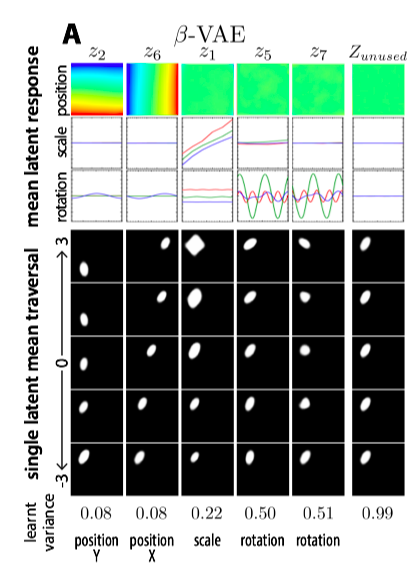

* $\beta$-VAE: Learning Basic Visual Concepts with a Constrainted Variational Framework
* Irina Higgins, Alexander Lerchner

# Motivation

The idea is simple. And I think the key contribution is to point out that $\beta$ controls the degree of disentanglement.

The objective is to learn a disentangle representation for data. Disentangle means, variation in one generative factor corresponds to variation in a **single** latent unit.

Current approaches often assumes prior knowledge about the generative factor. This is not always true.

InfoGAN does a good job. However, there are some disadvantages:

* Training instability, reduced sample diversity (GAN's)
* Lacks a principled inference network.

So the idea is to use VAE. The only change is to add more weight on the KL term. **The key is the $p(z)$ is an isotropic unit Gaussian**, implying different component are independent. So this constraint also makes the learnt factor independent.

# $\beta$-VAE Framework

We assume that each image is generated as follows:

* Some factors $v, w$ are drawn from $p(v), p(w)$
* $x$ is generated from $p(x|v, w) = Sim(v, w)$, where $Sim$ is some real world simulator (like a graphical engine).
* **Besides, each component of $v$ is conditionally independent**. This means $\log p(v|x) = \sum_k\log p(v_k|x)$.

Our goal is to latent a inference network describing $q_\phi(z|x)$, such that $q_\phi(z|x)$ capture the generative factors $v$ in a disentangled manner. This can be achieve by matching it to a isotropic unit Gaussian $p(z)$. Combining reconstruction loss in VAE, we then have the constrained optimization problem 
$$
\max _{\phi, \theta} \mathbb{E}_{x \sim \mathbf{D}}\left[\mathbb{E}_{q_{\phi}(\mathbf{z} | \mathbf{x})}\left[\log p_{\theta}(\mathbf{x} | \mathbf{z})\right]\right] \quad \text { subject to } D_{K L}\left(q_{\phi}(\mathbf{z} | \mathbf{x}) \| p(\mathbf{z})\right)<\epsilon
$$
The generalized Lagrangian:
$$
\mathcal{F}(\theta, \phi, \beta ; \mathbf{x}, \mathbf{z})=\mathbb{E}_{q_{\phi}(\mathbf{z} | \mathbf{x})}\left[\log p_{\theta}(\mathbf{x} | \mathbf{z})\right]-\beta\left(D_{K L}\left(q_{\phi}(\mathbf{z} | \mathbf{x}) \| p(\mathbf{z})\right)-\epsilon\right)
$$
This can be rewritten into
$$
\mathcal{F}(\theta, \phi, \beta ; \mathbf{x}, \mathbf{z}) \geq \mathcal{L}(\theta, \phi ; \mathbf{x}, \mathbf{z}, \beta)=\mathbb{E}_{q_{\phi}(\mathbf{z} | \mathbf{x})}\left[\log p_{\theta}(\mathbf{x} | \mathbf{z})\right]-\beta D_{K L}\left(q_{\phi}(\mathbf{z} | \mathbf{x}) \| p(\mathbf{z})\right)
$$
**The important thing to note here is, for a particular problem, optimzing $\mathcal L$ with a particular $\beta$ is equivalent to optimizing the constrained problem with a particular $\epsilon$. **

Interpretation: $\beta$ controls the trade-off between information capacity of $z$ and the degree of disentanglement.

# Disentanglemnt metric

First, a new data set is generated as follows.

Let's assume that $v \in \R^K$. To generate a single dataset, 

1. $y\in \{1, \ldots, K\}$ is randomlly chosen
2. For $l =1, \ldots, L$
   1. $(v_{li}, w_{li}), (v_{lj}, w_{lj})$ is generated from $p(v)$ and $p(w)$.
   2. **Set $v_{liy} = v_{ljy}$**. This means that we restrict one factor to be unchanged. So we will predict what is this factor is in this task.
   3. Generate $x_{li}, x_{lj}$.
   4. Generate $z_{li}, z_{lj}$. 
3. Compute $z_{diff}= \frac{1}{L}\sum_{l= 1}^L|z_{li} - z_{lj}|$

Then one data point will look like $(z_{diff}, y)$. This is just a classification problem and we can measure the accuracy.

# Experiments

Compared with InfoGAN, DC-IGN, VAE

* Qualitatively
  * Better disentanglement.
  * Learns extra unlabelled data generative factors that DC-IGN cannot learn (it is semi-supervised)
* Quantitative benchmarks
  * Just better.

Some words about this figure. So the dataset they use is generated, so they have fine-grained control over factors.

* First, how the dimensions are selected: given an image, find sigma $q_\phi(z|x)$. Sigma will imply the information contained.
* The first three row: we vary the **ground truth** factors ($v$), and see how the predicted mean ($\mu_z$) changes
* The last five rows: we vary the mean $\mu_z$, and watch how the generated image changes.

# Understanding the effects of $\beta$

We try to figure out what is optimal $\beta$ under different latent size $z$. Let the size of data by $M$ and latent size be $N$, we define $\beta_{normalized} = \frac{\beta M}{N}$.

It is found that

* There is a positive correlation between $\beta_{norm}$ and $n$.
* Given $n$, the relationship between disentanglement performance and $\beta$ is like a U-curve.
* VAE reconstruction quality is a poor indicator of learnt disentanglement.

