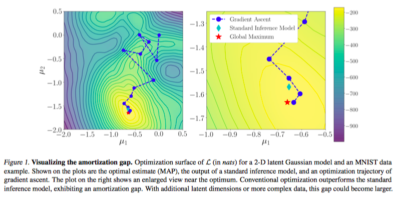
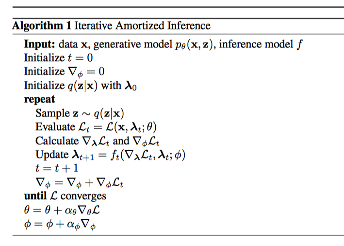

* Iterative Amortized Inference
* Josehn Marino, Yisong Yue, Stephen Mandt

## The Two Variational Inference Approach

Consider an approximate posterior of form $q_\lambda (z|x)$. Here, $\lambda$ is a function of $x$. 

Here we only consider the **inference** problem. That is, given $\theta$ and $x$, find $\lambda$.

### Variational Expectation Maximization (EM) via Gradient Ascent

This approach optimizes $\lambda$ for **each** $x^{(i)}$ separately. Optimization is straightforward:
$$
\lambda ^{(i)} \leftarrow \lambda ^{(i)} + \alpha \nabla_\lambda\mathcal L(x^{(i)}, \lambda; \theta)
$$
There are several problems here:

* $\nabla_\lambda\cal L$ is intractable. It must be evaluated stochastically, which is expensive (?)
* This process has to be repeated for each $x$.
* We have to set $\alpha$.

### Amortized Inference Models

Here we will assume that a global parameter $\phi$ exists such that $p_\theta(z|x)$ can be reasonable well approximated with $q_\phi(z|x)$. Basically, we are modelling $\lambda$ as $\lambda  = f(x; \phi)$.

With some tricks, this allowed optimization with SGD in minibatches, and is scalable.

We will refer to this as _standard inference models_.

## Iterative Amortized Inference

The author has compare the two optimization method and draw the following conclusion:

* Gradient ascent requires many iterations and is sensitive to step-size. However, it will reach global optimal (of course)
* Standard inference model is fast, but failed to reach global optimum.

The second is known as an **amortization gap**. 

Remark: I think this is due to the assumption that $q_\phi(z|x)$ can approximate $p_\theta(z|x)$ globally. The relationship between $\lambda$ and $x$ maybe be able to be model by a function $f$.

### Learning to Iteratively Optimize

Now, we want to use standard inference model as a basic framework. However, we would like to go beyond this direct mapping between $x$ and $\lambda$. 

Remember that we keep $\theta$ fixed. In this case, a simple idea is just to backprop on $\phi$. It seems that there are previous work on this?

A more advanced idea proposed in this paper is to let the network _learn_ to optimized $\lambda$, given $\nabla \lambda$ and other information.

### Iterative Inference Model

The iterative model will be called $f$, parametrized by $\phi$. Let $\mathcal L_t^{(i)} = \mathcal L(x^{(i)},  \lambda_t^{(i)}; \theta)$ as the ELBO, the update rule is given by
$$
\lambda_{t + 1}^{(i)} \leftarrow f_t(\nabla_{\lambda}\mathcal L_t^{(i)}, \lambda_t^{(i)}; \phi)
$$
At the end of this iteration, we can expend theses steps and obtain a computation graph. When evaluate the final ELBO with $\lambda_T^{(i)}$, we will get gradient backproped to $\phi$, as well as for $\theta$.

The algorithm for one iteration:

## More theories and details

Some derivations are tricky for me now. I may update this part later.

