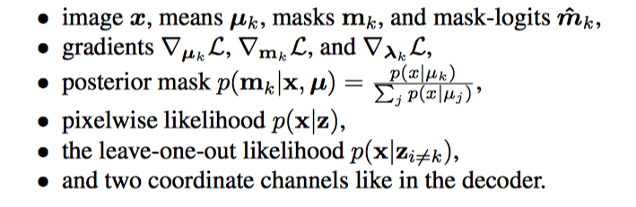

* Multi-Object Representation Learning with Iterative Variational Inference
* Klaus Greff, Alexander Lerchner

## Abstract

Previous work either focus on segmentation or representation learning. This work learns to segment and represent objects _jointly_. 

## Method

### Multi-Ojbect Representation

Consider a dataset with each image composed of multiple objects, 

* We should assume the existence of $k$ latent variables $z = \{z_1, \ldots, z_k\}$.
* The likelihood is modelled as a mixture of gaussian, where **each component depends on exactly one latent variable**. That is

$$
p(x|z) =  \prod_{i =1}^D \sum_{k = 1}^Km_{ik}\cal N(x_i |\mu_{ik}, \sigma^2_x)
$$
**Decoder Structure**. The problem is to decode $z_k$ to $m_k$ and $\mu_k$. We use **spatial broadcast network**. All slot share weights to ensure a common format.

### Inference

The goal is to find good $\lambda$ for $q_\lambda(z|x)$. The author proposed three difficulties

* Firstly, being a (spatial) mixture model, we need to infer both the components (i.e. object appearance) and the mixing (i.e. object segmentation).
* One slot may suffice. There is no reason that the inference procedure will model one object with one single slot. **Strong coupling may happend**. 
* Slot permutation invariance induces a multimodel posterior with at least one mode per slot permutation. This means that **each permutation should be equally likely**. But VAE $q_\lambda (z|x)$ is uni-modal.

**Iterative Inference**. I'm still confused why this helps to tackle the above problem.

I think the most important idea is to update $\lambda_k$'s **seperately**, using information specific to $k$. As in Iterative Amortized Inference, for each training example $x^{(i)}$ and $k$, they will start with a random guess $\lambda_k$, and iteratively optimize $\lambda_k$, using some information in the network. Since we are backpropagating into the parameter $\phi$ of the refinement network, we expect it learns how to optimize. This is how they do it:
$$
z^{(t)}_k \sim  q_\lambda(z_k^{(t)}|x)\\
\lambda_k^{(t + 1)} \leftarrow \lambda_k^{(t+1)} + f_{\phi}(z_k^{(t)}, x, a_k)
$$
Where $a_k$ contains the following information:

# Results

## Representation Quality

Segmentation

* Figure: visualization on CLEVR, dSprites, Tetris
  * Each line: image, recons, mask, individual masked reconstruction
  * mask is colored
* ARI:
  * On CLEVR, Multi dSprites, Tetris
  * with binarized Multi-dSprite, compares it with RNEM

Information Content

* On, CLEVR, factor regression on Color, Position, Shape, Size, with metric R^2
  * Creating training set: it seems that this requires manual efforts.

Disentanglement

* The figure, with VAE and IODINE

Generalization

* On a scene with more objects, with results on iterations shown
* Green sphere

Multi-modal

* Run for many times

